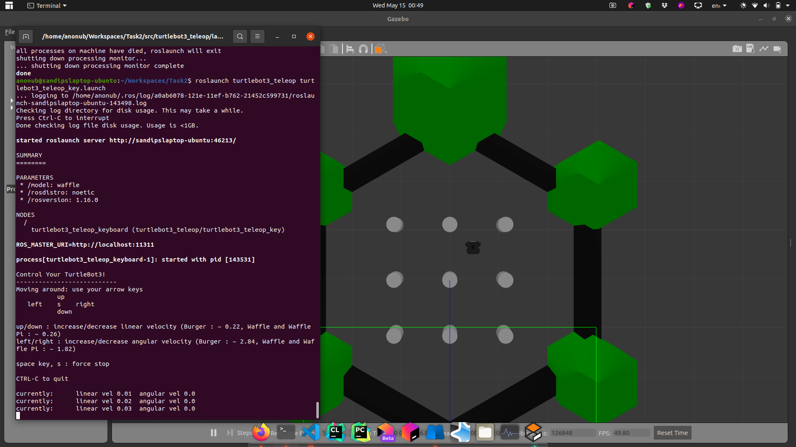
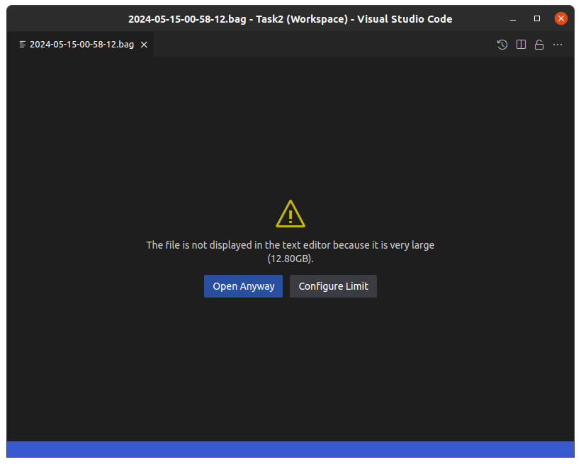
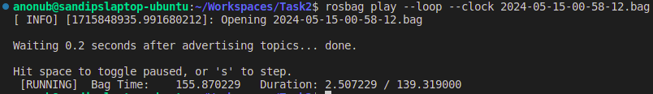
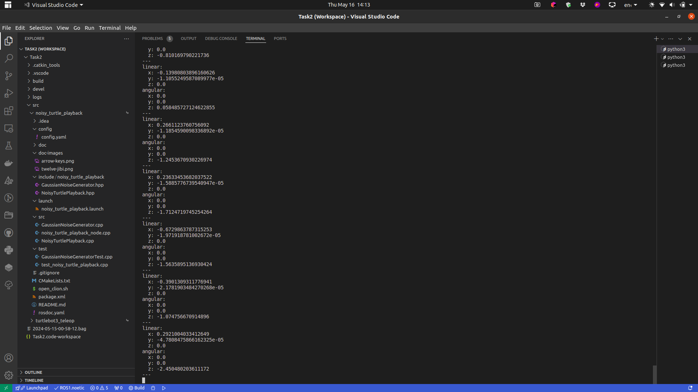

# Overview

<!-- TODO: add overview -->

## Initialization

```bash
cd ~/Tasks
catkin_create_pkg noisy_turtle_playback roscpp nav_msgs gtest doxygen
cd noisy_turtle_playback
git init
```

## Installing and setting up Turtlesim3

```bash
#Installing dependencies of turtlesim3
sudo apt-get update \
&& sudo apt-get install -y ros-noetic-joy ros-noetic-teleop-twist-joy \
ros-noetic-teleop-twist-keyboard ros-noetic-laser-proc \
ros-noetic-rgbd-launch ros-noetic-rosserial-arduino \
ros-noetic-rosserial-python ros-noetic-rosserial-client \
ros-noetic-rosserial-msgs ros-noetic-amcl ros-noetic-map-server \
ros-noetic-move-base ros-noetic-urdf ros-noetic-xacro \
ros-noetic-compressed-image-transport ros-noetic-rqt* ros-noetic-rviz \
ros-noetic-gmapping ros-noetic-navigation ros-noetic-interactive-markers
#Installing turtlebot3 via Debian packages
sudo apt-get update \
  && sudo apt-get install -y ros-noetic-dynamixel-sdk \
  ros-noetic-turtlebot3-msgs ros-noetic-turtlebot3
```

## Controlling turtlebot3 using ROS and arrow keys

Initially, I didn't know the Keycodes for the arrow keys, \
but I knew that this command lets people control the `turtle1` in `turtlesim` using arrow keys: \
`rosrun turtlesim turtle_teleop_key`

So, I checked its [source code](https://github.com/ros/ros_tutorials/blob/noetic-devel/turtlesim/tutorials/teleop_turtle_key.cpp) and found out that the relevant keycodes are:

```cpp
#define KEYCODE_RIGHT 0x43
#define KEYCODE_LEFT 0x44
#define KEYCODE_UP 0x41
#define KEYCODE_DOWN 0x42
#define KEYCODE_Q 0x71
```

Now, since the official `turtlebot3_teleop` package doesn't use the arrow keys, \
I cloned it: \
`git clone https://github.com/ROBOTIS-GIT/turtlebot3/` \
and created symlink to the package in the src folder of my workspace: \
`ln -s ~/git/turtlebot3/turtlebot3_teleop`

Then edited the `turtlebot3_teleop/nodes/turtlebot3_teleop_key` file, finally turned it into [this](https://gist.github.com/real-Sandip-Das/e97fc8cff416c464ccf0dcdcadc0c9cb) and saved it, \
rebuilt the package using `catkin build turtlebot3_teleop`

In order to test it, I installed the following package: \
`sudo apt install ros-noetic-turtlebot3-simulations`

Then, on one terminal I ran `roslaunch turtlebot3_teleop turtlebot3_teleop_key.launch` (after sourcing `devel/setup.bash`) \
and, in another: `roslaunch turtlebot3_gazebo turtlebot3_world.launch` \
(on both, `export TURTLEBOT3_MODEL=waffle` needs to be done first)

It worked totally fine



## Recording topics into a bag file

Recorded all the topics that were being published using `rosbag record --all`

Kept recording while driving `turtlebot3` for quite a while, and pressed `Ctrl+C` to finish recording. \
The bag file ended up being 12.80 GB for some reason



## Adding Gaussian Noise to the velocity of `turtlebot3` and publishing it onto a new topic

Implementation Details:

- Odometry Readings (i.e. the `/odom` topic) have been used to get the velocity of `turtlebot3` at a specific time
- while adding Gaussian Noise, all the other dimensions except `linear: x` and `angular: z` have been neglected i.e. only 2D Gaussian Noise has been generated and added to the velocity readings
- Parameters of the generated gaussian noise (Variance of $v_x$, $\omega_z$ and the Covariance between them) can be modified in `config/config.yaml`

Relevant source code can be found in the following files:

`include/noisy_turtle_playback/GaussianNoiseGenerator.hpp`
`src/GaussianNoiseGenerator.cpp`
`include/noisy_turtle_playback/NoisyTurtlePlayback.hpp`
`src/NoisyTurtlePlayback.cpp`
`src/noisy_turtle_playback_node.cpp`

Mathematical Explanation can be found in the documentation generated by `doxygen` \
in order to view it, open the following file: \
`doc/html/index.html` (requires generating documentation)

Much of the details can be found in the documentation for the `generateGaussianNoise()` and `biVariateStandardNormal()` functions of the `noisy_turtle_playback::GaussianNoiseGenerator` class

### Testing

In order to run the `gtest`(Google Test) tests, run `catkin test` (or `catkin test noisy_turtle_playback` to avoid testing all the packages in the Workspace)

The tests were written in the following files: \
`test/GaussianNoiseGeneratorTest.cpp` \
`test/test_noisy_turtle_playback.cpp`

The test that I wrote, verifies that the evaluated Covariance Matrix of the generated noise is as expected (i.e. significantly close to the input Covariance Matrix)

Upon running the tests, the package succeeded

### Running

In one terminal, I ran:

```bash
catkin build
source devel/setup.bash
roslaunch noisy_turtle_playback noisy_turtle_playback.launch 
```

In another:

```bash
rosbag play --loop --clock 2024-05-15-00-58-12.bag
```

To verify whether the noisy data was being published correctly, I ran \
`rostopic echo /noisy_turtle_playback/noisy/cmd_vel` \
and `rostopic echo /odom` \
in two other terminals

on running, it works totally fine: \
 \
 \


## Generating Documentation

Doxygen was used to document this package

Here are the instructions to generate the documentation for this package on you local machine

Make sure you have latex installed:

```bash
sudo apt install texlive-latex-extra #installs latex
sudo apt install doxygen-latex #installs a few other dependencies
```

Move to the project's directory and run the following command to generate documentation in the `doc` folder:

```bash
doxygen Doxyfile
```
